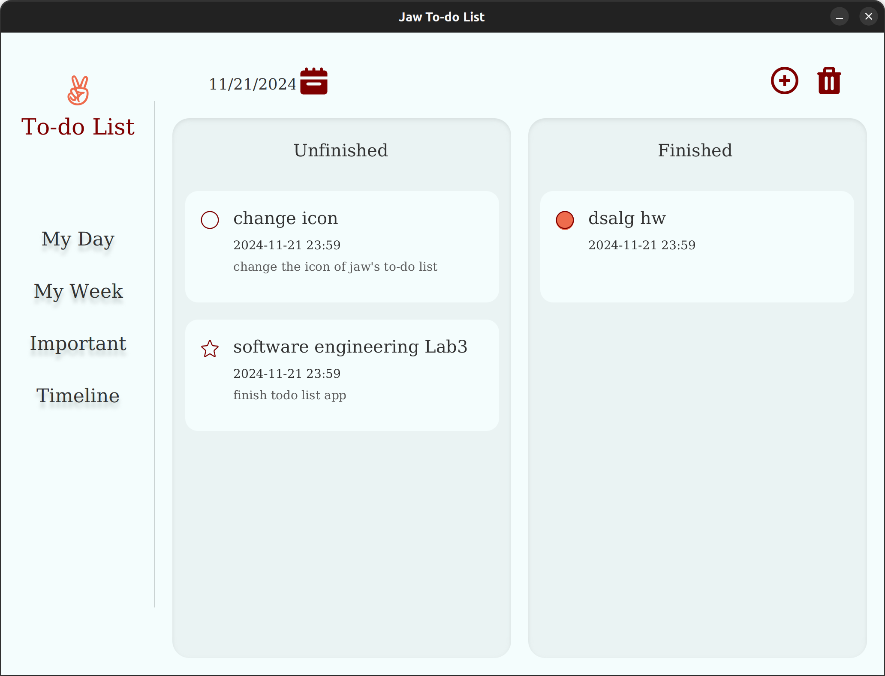
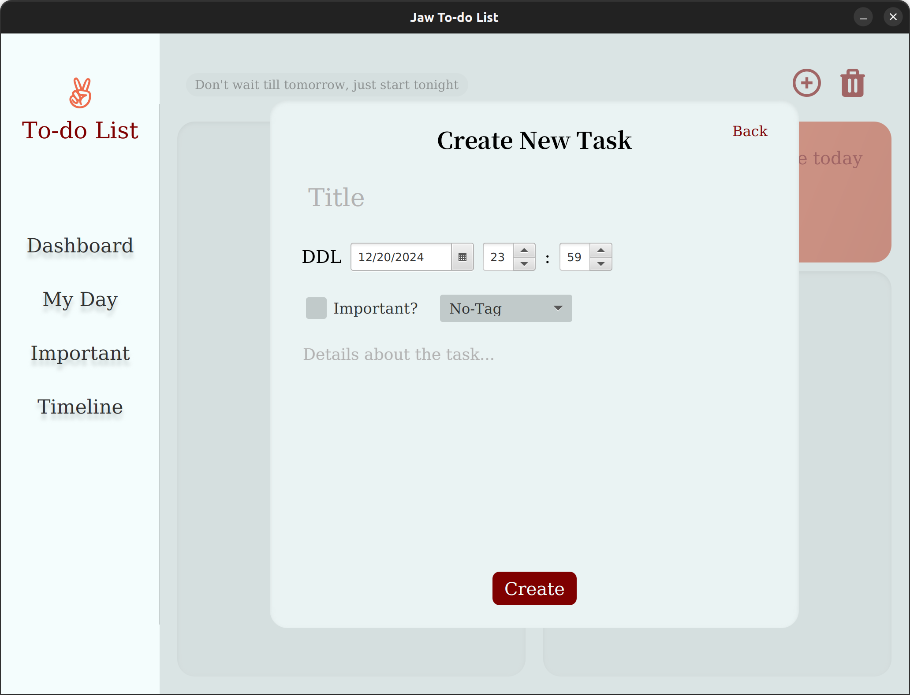

# To-Do List Application

This is a JavaFX-based To-Do List Application developed for the course project of Software Engineering 2024, NJU.

### Tech Stack

* Programming Language: Java
* Framework: JavaFX
* Database: SQLite
* Build Tool: Gradle

### Installation & Setup

Clone the repository:

    git clone https://github.com/zhux2/TodoList.git

Open the project in your preferred IDE (e.g., IntelliJ IDEA).
Run the Gradle build:

    ./gradlew build

Start the application:

    ./gradlew run

### Screenshots

##### My Day View

##### Add Task
